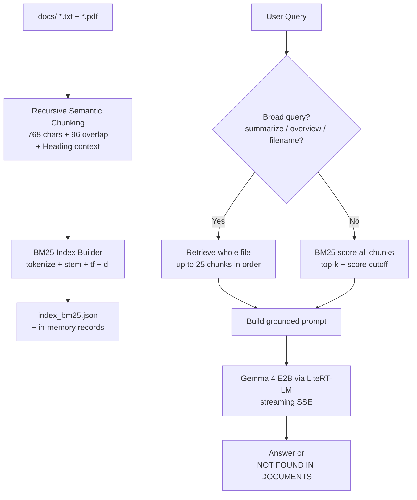

# Building Local AI RAG on a Phone: The PhoneRAG Learning Experiment

*How I built a complete Retrieval-Augmented Generation system that runs entirely offline on an Android phone — and what switching from embeddings to BM25 taught me.*

---

## The Premise

Most RAG tutorials assume you have:

- A big cloud LLM (OpenAI, Claude, Groq...)
- Vector databases (Pinecone, Chroma, FAISS)
- Embedding models (text-embedding-ada-002, nomic-embed, etc.)
- LangChain or LlamaIndex to glue it together

What happens when you strip all of that away and try to run useful RAG on a phone with ~4-8 GB RAM, no reliable internet, and a desire to keep your personal notes completely private?

That's the question **PhoneRAG** was built to answer.

The result is a tiny, self-contained system that:

- Runs **100% locally** on Android via Termux
- Uses Google's **LiteRT-LM** runtime + the **Gemma 4 E2B** (Edge 2B) model
- Replaces vector search with classical **BM25** keyword retrieval
- Ships a beautiful mobile-first web UI in a single Python file
- Needs **no embedding model at all**

---

## The Journey (and Why It Matters as a Learning Experiment)

The repo still contains the fossil record of its evolution in the `legacy/` and `cli/` directories. That history is the most valuable part of this project.

### Phase 1: "Classic" Local RAG (Ollama + Embeddings)

Early versions used:

- `embeddinggemma` (or later `nomic-embed-text-v2-moe`) via Ollama for vectors
- Cosine similarity over precomputed embeddings stored in JSON
- A small chat model (`gemma3:1b`) via Ollama's `/api/generate`

**Problems on a phone:**

1. You now need *two* models loaded (or constantly swapping).
2. Ollama on Termux is heavy.
3. Embedding models still consume precious RAM even when using `keep_alive: 0`.
4. Vector search felt overkill for personal document collections (usually < 100 files).

The system worked... but it was slow to start, fragile on low memory, and required running an Ollama server.

**Evolution at a glance**:

| Phase         | Retrieval          | Generation             | Models in RAM      | Mobile Friendliness |
|---------------|--------------------|------------------------|--------------------|---------------------|
| Legacy (Ollama) | embeddinggemma (cosine) | gemma3:1b via Ollama | 2+                 | Poor                |
| Nomic trials  | nomic-embed via Ollama | same                   | 2                  | Poor                |
| **Final**     | **Pure BM25**      | **Gemma 4 E2B + LiteRT** | **1**            | **Excellent**       |

### Phase 2: The Pivot — Drop the Embedding Model

The breakthrough was realizing:

> For small, personal collections, **good keyword search often beats mediocre embeddings** — especially when you control the chunking and can afford to score every chunk.

We switched to:

- Pure BM25 (implemented from scratch in ~50 lines of Python)
- A lightweight Porter stemmer + hand-curated stopwords
- Pre-computed term frequencies (`tf`) and document lengths (`dl`) at index time
- A single on-device inference engine: **LiteRT-LM + Gemma 4 E2B**

Result: One model in memory. Much lower RAM. Surprisingly good relevance for the kinds of questions people actually ask their notes.

---

## How PhoneRAG Actually Works



**Pipeline steps**:

1. **Ingest** — `chunk_text()` + `tokenize()` + `term_freq()` into records
2. **Retrieve** — `bm25_score()` (or broad bypass)
3. **Generate** — `build_prompt()` + `litert_lm.Engine` streaming

### 1. Chunking (Surprisingly Important)

See `chunk_text()` + `_recursive_split()` in [app.py](/root/PhoneRAG/app.py:121) and [cli/build_index.py](/root/PhoneRAG/cli/build_index.py).

The strategy:

- Detect headings and attach them as context prefix: `[Heading] text...`
- Recursively split using the first separator that produces multiple pieces: paragraphs → `\n` → sentence regex → `;` → `,` → space
- After splitting, merge small fragments while creating overlap

```python
SEPARATORS = ["\n\n", "\n", _SENTENCE_RE, _SEMICOLON_RE, _COMMA_RE, " "]

pieces = _recursive_split(section_text, SEPARATORS, CHUNK_MAX)
merged = _merge_small_chunks(pieces, CHUNK_MAX, CHUNK_OVERLAP)
```

This produces higher-quality passages than naive fixed-size splits, which is critical when your retriever is keyword-based.

### 2. BM25 (From Scratch)

The index stores for every chunk:

```json
{
  "file": "company_onboard.txt",
  "chunk_id": 3,
  "text": "...",
  "tf": {"project": 2, "harbor": 4, ...},
  "dl": 142
}
```

At query time we compute IDF once, then score every chunk. Here's the core from [cli/ask.py](/root/PhoneRAG/cli/ask.py) and [app.py](/root/PhoneRAG/app.py):

```python
def bm25_score(query_tokens, rec, idf, avg_dl):
    score = 0.0
    tf = rec["tf"]
    dl = rec["dl"]
    for t in query_tokens:
        if t not in idf: continue
        f = tf.get(t, 0)
        num = f * (BM25_K1 + 1)
        den = f + BM25_K1 * (1 - BM25_B + BM25_B * dl / avg_dl)
        score += idf[t] * num / den
    return score
```

No FAISS. No NumPy. Just pure Python dicts. Surprisingly fast enough for personal use.

Special handling for "broad" queries (`summarize`, `overview`, `tell me about...`):

- Detect filename in the question → return up to 25 chunks from that file in order.
- This makes "summarize my onboarding doc" actually useful.

### 3. Generation with LiteRT-LM

Key details that took painful debugging:

- Load **one** `litert_lm.Engine` at startup.
- Reuse it across conversations (reloading the model is expensive).
- Careful conversation lifecycle: on cancel, we *abandon* rather than call `close()` or cancel — both caused interpreter hangs or memory leaks on device.
- Sampler tuned conservatively (`temperature=0.1, top_k=20`) for grounded answers.
- Prompt engineering is brutal with a 2B model: every word in the system + user prompt counts.

The prompt always ends with:

> If the answer is not in the context, write only: NOT FOUND

This works shockingly well.

### 4. The Self-Contained UI

`app.py` contains the entire frontend as a giant `HTML` string (1,200+ lines of carefully written CSS + vanilla JS).

Why?

- Zero network dependencies after the initial page load.
- Works great in Termux + Chrome on Android.
- SSE streaming for tokens + build progress.
- Tabs for RAG vs free chat.
- Drag & drop + streaming index builder.
- Image + .txt attachments in free chat (the model supports vision).

The frontend even does light post-processing to strip accidental Markdown the small model sometimes emits.

---

## Key Lessons from Building This

### 1. Classical IR Is Underrated for Personal RAG

BM25 + decent chunking + small focused collections can outperform "embedding + vector DB" setups that are poorly tuned. The latter often lose to simple keyword methods when documents are short and domain-specific.

### 2. Memory Is the Real Constraint on Edge

Every additional model you load has a cost. Removing the embedding model was the single biggest win.

### 3. Chunking + Context Engineering > Retrieval Algorithm (at small scale)

We spent more time making the chunker preserve headings and semantic boundaries than tuning BM25 parameters. It paid off.

### 4. Streaming + Cancel Handling Is Hard on Constrained Runtimes

The most subtle bugs were around conversation cleanup. On phones, "just call cancel" can freeze your process for minutes. We had to design around the constraints of LiteRT-LM.

### 5. One File Can Be a Complete Product

Having `app.py` be both the backend *and* the entire UI (no templates, no static assets) made iteration incredibly fast. For learning experiments and personal tools, this is a superpower.

### 6. "NOT FOUND" Is a Feature

Forcing the model to say `NOT FOUND IN DOCUMENTS` (or just `NOT FOUND`) when context is insufficient dramatically reduces hallucinations. Users quickly learn to trust the system more.

---

## Limitations (Be Honest)

- Linear scan over all chunks — fine for hundreds/thousands of chunks, painful beyond that.
- No incremental updates (changing a file requires re-index or manual cleanup).
- BM25 has no semantic understanding (paraphrase questions can fail).
- 2B model is small — it follows instructions well but has limited world knowledge outside the provided context.
- Single user, single device by design.

---

## How to Reproduce the Experiment

1. Install Termux from F-Droid.
2. `pkg install python git`
3. Get a LiteRT-formatted Gemma 4 E2B model (`gemma-4-E2B-it.litertlm`).
4. `pip install litert-lm-api flask pypdf --break-system-packages`
5. Clone this repo, drop some PDFs/txt files in `docs/`.
6. `python app.py` and open `http://localhost:5000`.

Or just run the CLI versions in `cli/`.

You can also run the older embedding-based versions if you have Ollama installed (see `legacy/` and the `*_nomic.py` scripts).

---

## What I Would Try Next

- Hybrid retrieval (BM25 first stage + tiny reranker)
- Better broad-query detection (or a tiny classifier)
- Quantized embedding model *only when needed* (lazy load)
- Export the index as a single portable file + viewer
- Add very lightweight graph connections between chunks (for "tell me more about X mentioned earlier")

---

## Conclusion

PhoneRAG is not trying to be production infrastructure. It is deliberately a **learning experiment** that asks:

> What is the *simplest possible* RAG system that is still genuinely useful for personal knowledge on extremely constrained hardware?

The answer surprised me: **no vector database, no embedding model, one small on-device LLM, careful chunking, and a 50-line BM25 implementation** is enough for a surprising amount of real work.

If you're interested in local AI, edge deployment, or just want to deeply understand how RAG actually works under the hood, I highly recommend building something like this yourself — preferably with one hand tied behind your back (limited RAM, no cloud, single file).

The constraints force clarity.

---

**Repo**: https://github.com/shanptom/PhoneRAG (or the local copy you're looking at)

**Technologies highlighted**:
- LiteRT-LM / Gemma 4 E2B
- Pure Python BM25
- Recursive semantic chunking
- Self-contained Flask + vanilla JS mobile UI
- Termux on Android

*Written as a companion to the PhoneRAG codebase to capture the learning journey.*

---

*Thanks for reading. Go build something small and offline.*
